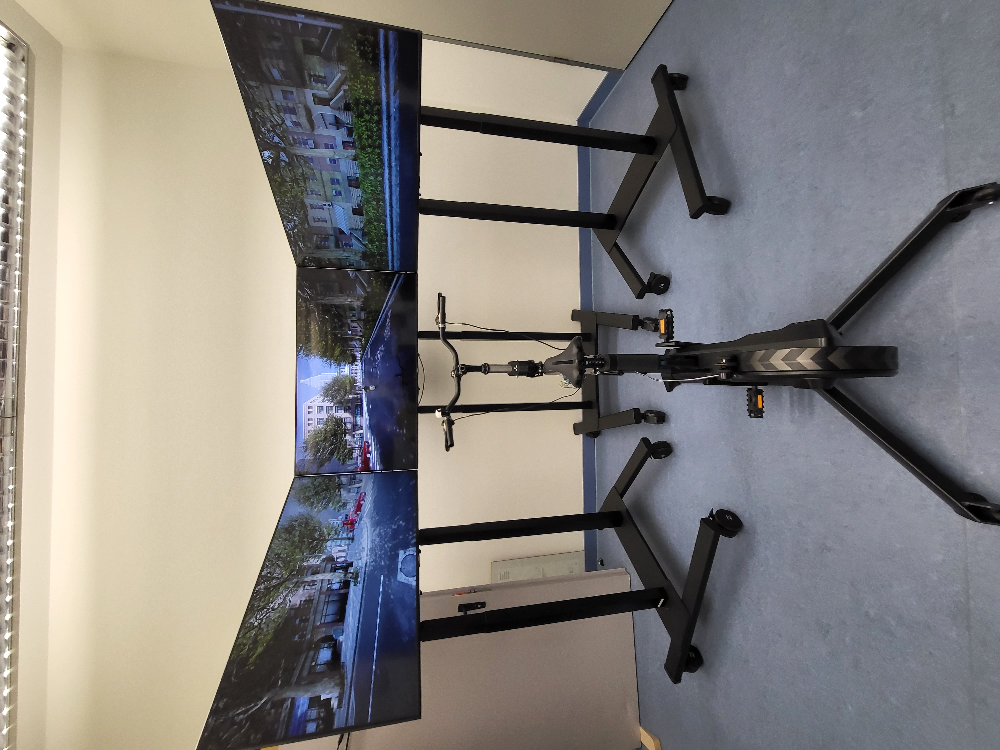

# Introduction

Welcome to the Open Bicycle Simulator Standard, an open source standard for bicycle simulators. This standard is set out to help create a standard in bicycle simulators. As of now there is no set standard of how to build a bicycle simulator and each bicycle simulator that has been so far created has been different by using different software, equipment, and methodology. These simulators are also typically not well documented, leaving other researchers to wonder how the other created their simulator. It also creates a lot of duplication of work, as researchers have to start from the beginning each time researching how to create a bicycle simulator. This open standard hopes to address these issues by being open source, by having open documentation of how everything was done, by using open source software where possible, and by having reliable, replicable, and accurate methodologies, so that the research done with these bicycle simulators can be validated by anyone interested in the field of bicycles simulators.

# Bicycle Simulators

What is a bicycle simulator? A bicycle simulator is a tool to replicate bicycling but in a simulated and controlled environment. In this simulation, things can be replicated to be tested. Test may include critical situations, interactions between different road users, new technologies, behavioral studies, etc. There are almost no limits of what can be tested in the simulated environment, but why use a bicycle simulator instead of real world testing? Simulators provide some great features, which may be difficult to do in real world testing, such as critical situations between different road users, where a subject could be hurt in the process during a scenario, like when a car would pull in front of a bicyclist. Simulators also provide a repeatable and reliable platform, where the scenario can be reproduced once again without introducing human error of when the scenario would play out. This makes the data very reliable and reduces any discrepancies that may be produced from human factors. Although this is a great platform, simulators do have some limitations when it comes to testing, the greatest would be when looking at dynamics of the bicycle. Simulators have difficulty replicating these dynamics in an accurate way, as bicyclist can lean and adjust their weight as they are moving and can use those forces to control the bicycle. Simulators are typically static, although some do have some degrees of freedom to reproduce these actions, but do not fully reproduce the actions entirely, which a bicyclist would make while riding a bicycle. As simulators cannot fully reproduce these actions, the steering and dynamics of a cyclist on the simulator cannot be validated for the real world, as users would ride dynamically different

# Objectives of Standard

As stated before, a part of this standard is to set standards for bicycle simulators. Setting these standards can come with great benefits, which have been lacking in bicycle simulators thus far. These benefits are repeatability, reliability, validity, and improved accuracy. With standards set, research that is conducted on bicycle simulators can be transferred to other research groups and the research done can be continued or validated by another group. Of course with the benefit of having some baseline from a standard, improvement and changes can be explored.

# Basic Requirements to Get Started

Some basic requirements before getting started with building a bicycle simulator. Space is obviously required to build the simulator. It is recommended you have a space around 3 meters by 3 meters at the minimum. This should provide enough space for all the equipment. It is also recommended that you have some knowledge on computers, computer languages, working with basic bicycle tools, small electronics, and CAD. In this guide we will provide a detail guide on how to do everything although some of it may be difficult to understand if there is a lack of prior knowledge in these areas, but by no stretch, must someone be an expert in each of these fields. If difficulties arise in any of these areas while building the bicycle simulator, it is recommended to reach out to our group or to other experts in this field or related fields for help. People are always willing to help, if you ask them nicely. Although a simulator can be built on a tight budget, the simulator has its expenses, which include the bicycle trainer, small electronics, computers, displays, stands, and software. All of which can quickly add up and make a bicycle simulator expensive, depending on the equipment purchased and needs of the research. It is recommended to budget a minimum of 10,000 euros (as of 2024) for a complete setup of the bicycle simulator to meet the standards set in this guide.

# Ideal Research for Simulator

As of December 11, 2024, the ideal research applications for this simulator include testing the validity of gradient simulations in bicycle simulators, particularly for small gradients ranging from -4% to +4%. The simulator can also be employed to evaluate new bicycle infrastructure designs that primarily require a forward-looking view of the infrastructure. While other use cases, such as safety scenarios, could be explored, their validity is constrained by the simulator's limited field of view and lack of audio.

# Requirement Overview

Creating a bicycle simulator can be a complicated process to break and has many parts to it. To make this simpler, it will be broken down into a few important parts. The first part will be the basic equipment, which includes the bicycle trainer, displays, and computer. The second part is the small electronic equipment, which handles some of the inputs of the simulator, as well as taking measurements during the research on bicycle simulator. The last and most important part is the software. Software is the backbone of the simulator and makes it possible for the simulation to create enticing visuals and creates the scenarios that are of interest in research. Each of these sections will be touched in more detail in further chapters.

# Limitations 

This bicycle simulator standard of course is a great tool and should be able to provide for many use cases, but with this standard comes limitation. These limitations have already been touched on, but it must be repeated nonetheless. As stated earlier, bicycle dynamics is one of the biggest limitation of this simulator standard. In this simulator, the exact dynamics, are somewhat ignored, as it is very difficult at the moment to replicate and the technology to replicate only partially replicates the dynamics. Thus, the steering dynamics, cannot be validated in any study, while using this standard set within. Another limitation to the simulator is the onset of virtual sickness. Virtual sickness can affect subjects using any simulator, be it a car simulator, motorcycle simulator, or bicycle simulator. Virtual sickness can affect subjects reactions and ability to do the study, which will directly affect any results from a study.
