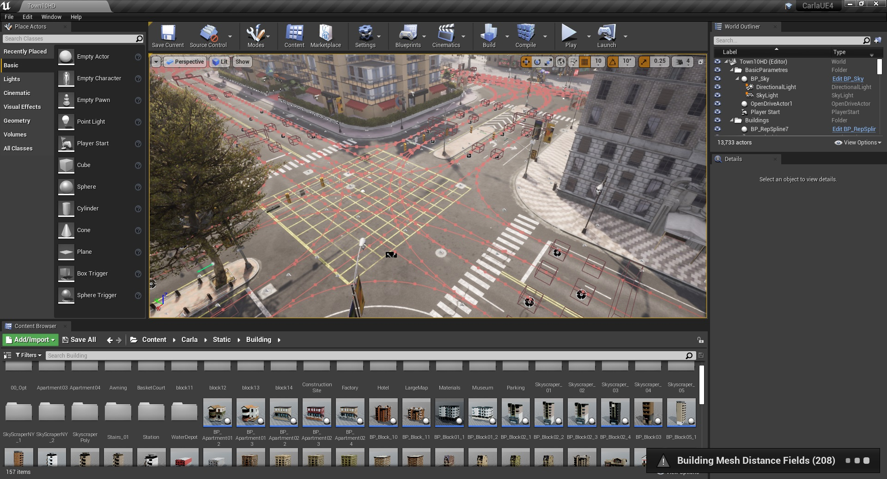
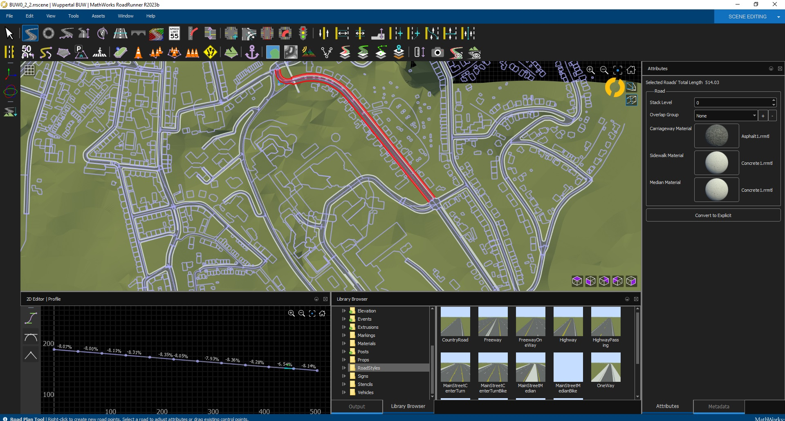

# Software

Software is the backbone of the bicycle simulator. Of course, basic simulators may not have any display or just record basic outputs, but with today technology we can create virtual environments and create virtual scenarios. There are two primary pieces of software which are used in virtualization and the creation of the virtual environment and that are Unity and Unreal Engine. Both have been used in many simulation projects. In this case we recommend Unreal Engine, as there has been some more development from other research groups to develop packages which are useful in developing a simulator and managing things like traffic. There are many versions of Unreal Engine, but we recommend and support the use of a branch of Unreal Engine Called CARLA. This branch was developed for Autonomous vehicle simulation, but can be easily adjusted for non-AV vehicle use. Unreal Engine is the backbone of the simulation software, but with the provide maps, could limit your research and scenarios. To be able to create a new scenario, it is required to use RoadRunner, which is unfortunately a product of Mathworks, but is a great fully fleshed out software, with a lot of capabilities and functions for creating custom maps. Other similar software fall short of the feature sets that RoadRunner does provide, like Truevision.

## Computer Languages Required 

The need to have some python language skills. You can learn some basic python skills at the link below. Although this may not be enough for developing and using the simulator. 

[Learn Python](https://www.learnpython.org/)

C++ is also good to have as this is the computer scripting language of Unreal Engine and will be needed so that features and changes can be added for scenarios.

## Simulation Software

As stated before CARLA is a branch of Unreal Engine 4 and at it current state is unfinished, although at this unfinished stage provides a somewhat ready to go virtual environment, with weather, traffic, and other useful features. It also has many plugins, which are quite useful, like connection to microscopic modelling software like SUMO or PTV VISSIM. Although it has many great features, it is still in an unfinished state, which may cause issues and problems, especially when it comes to installation. It is recommended to build CARLA on a fairly robust computer, as it is very compute intensive, compared to other software products. It is also important to have some computer literacy with command line and python to make the installation and troubleshooting easier. In the computer Setup section of this guide, you will find a guide on how to best build CARLA. 

[Computer Setup](../Setup_and_Building_of_Simulator/Setup_of_Scenarios)

## Scenario Building Software

As stated before, RoadRunner is the recommended software to create new maps for your scenarios. It is a pretty flushed out software, which is easy to understand and start using right away. You may need some knowledge of GIS and how to get data from OSM (Open Street Maps) so that your maps are accurate as possible, if recreating real world spaces. Although this is not necessary if you are creating a scenario of a fictional place, you won't need OSM or elevation data. As stated earlier, there are other software programs that can be used like Truevision Designer, but the software is in very earlier stages and is somewhat difficult to work with at these stages. Other software to help build your environments are blender, which is an open source and free to use software 3D software. It is good to build models as well as great for creating buildings. You can find more information on the scenario software in the following chapter. 

