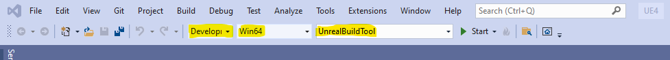
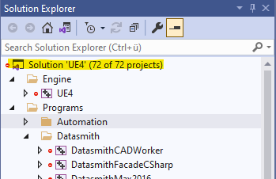
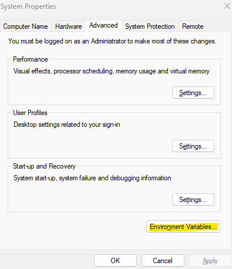
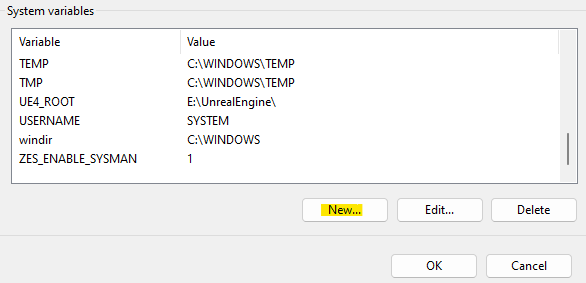
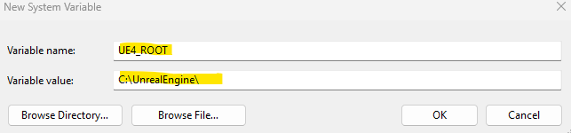

# Computer Setup

Software is the backbone of the bicycle simulator. Of course, basic simulators may not have any display or just record basic outputs, but with today technology we can create virtual environments and create virtual scenarios. There are two primary pieces of software which are used in virtualization and the creation of the virtual environment and that are Unity and Unreal Engine. Both have been used in many simulation projects. In this case we recommend Unreal Engine, as there has been some more development from other research groups to develop packages which are useful in developing a simulator and managing things like traffic. There are many versions of Unreal Engine, but we recommend and support the use of a branch of Unreal Engine Called CARLA. This branch was developed for Autonomous vehicle simulation, but can be easily adjusted for non-AV vehicle use. Unreal Engine is the backbone of the simulation software, but with the provide maps, could limit your research and scenarios. To be able to create a new scenario, it is required to use RoadRunner, which is unfortunately a product of Mathworks, but is a great fully fleshed out software, with a lot of capabilities and functions for creating custom maps. Other similar software fall short of the feature sets that RoadRunner does provide, like Truevision.

## Simulation Software Installation

Below is a step-by-step guide of how to build CARLA on the computer for the bicycle simulator, as the official guide can be sometimes vague on how to build the software. If our guide is unclear, you can find the official build guide here: 

1. First, we need to install some applications to be able to build CARLA, the first of which to install is CMAKE x64 

[Download CMAKE](https://cmake.org/download/)

2. Install Git

[Download Git](https://git-scm.com/download/win)

3. Install Chocolatey to be able to install MAKE, follow the steps in this guide below

[Installing Chocolatey](https://chocolatey.org/install)

4. To install MAKE, open PowerShell and type

```
choco install make
```

5. Install 7-zip make sure it has access to all users and allow it to unpack all items

[Download 7-Zip](https://www.7-zip.org/download.html)

6. Install Python, It is recommended to have 3.9.13, but it seems most version are stable. Make sure to check the box to add the path in the installation

[Download Python](https://www.python.org/downloads/release/python-3913/)

7. Once Python is Installed, check if python and pip are installed by typing in Command Prompt

```
py -V
py -m pip -V
```

8. If error returns for python, please reinstall python and give it the path required so it can be called in Command Prompt, if error for pip type in code below into the command line, this will installs pip onto your python version

```
py get-pip.py
```

9. if no error, continue to next step

10. Next type in Command Line, this makes sure pip is up to date

```
py -m pip install -- upgrade pip
```

11. Install the following pip tools using the first commands in the Command Line and text file, which you can find below. You may have to direct pip to the correct folder to find the pipreq.txt, which may look like the second line of code

```
py -m pip install -r pipreq.txt
```

```
py -m pip install -r C:/User/example/downloads/pipreq.txt
```

[Pip Requirement Text](./pipreq.txt)

12. Once these packages are installed, you can validate their installation by typing in the following code

```
py -m pip list
```

13. Next to install Visual Studios 2019, which is required to build Unreal Engine

14. Please install Visual studios 2019, which had the most success for our installation

[Visual Studio Downloads](https://visualstudio.microsoft.com/de/vs/older-downloads/)

15. When installing Visual Studio, please also install these packages in the package manager X64 Visual C++ Toolset, Python tools, and .NET Framework 4.6.2

16. After installation is complete, also install this additional add-on Windows 8.1 SDK

[SDK 8.1 Download](https://developer.microsoft.com/en-us/windows/downloads/sdk-archive/)

17. Now with everything installed we can start with building Unreal Engine for CARLA

18. Open Command Prompt

19. Type the following command in the Command Prompt. As a note, this file is quite large and will take up over 100 GB of space. Please make sure your HDD or SDD has enough space for this file to download and build. Also a note is to put this file in the base root of your drive by typing in the following command before cloning the file

```
cd C:
```
or

```
cd ..
```
until you are at the highest folder of the drive, then type in the following command

``` 
git clone –depth 1 -b carla https://github.com/CarlaUnreal/UnrealEngine.git
```

20. Once the file is downloaded through git, we will set the folder to the downloaded folder in command line 

```
cd unrealengine
```

21. In command line, type in the following command

```
Setup.bat
```

22. Once Setup.bat is finished, type in the following command
```
GenerateProjectFiles.bat
```
23. Once complete, it is time to compile Unreal Engine, go into file explorer and find the folder Unrealengine and open this folder up. Inside should be a Visual Studio Solution called UE4.sln. Open this file

24. Once the file is open in Visual Studios and at the Solution page, change the build bar so that the following are displayed, 'Development Editor', 'Win64', and 'UnrealBuildTool'



25. Once the build bar is set up, the solution can be run. Right-click on the Solution UE4 and Build all items or Build in the Solution Explorer on the right side of Visual Studio



26. The Output console should show something and some kind of task being complete. This building will take some time depending on your computer hardware.

27. Once the solution is complete, you can now run Unreal Engine for Carla. You can check if the build was successful by navigating to the Unreal Engine folder and launching UE4Editor

```
C:\UnrealEngine\Engine\Binaries\Win64
```

28. Once built, you need to add the path for the Unreal Engine. This can be done be going to 'Advanced System Settings', then clicking on Environment Variables, then on new, then add a variable called UE4_ROOT and then add the file location of the UnrealEngine, we just installed, this will look something like C:\UnrealEngine\, if you installed it in the root of the drive and on your C: drive for example. 





29. Now to build and download CARLA. In Command Prompt select again the root folder for your drive 

```
cd C:
```
or type this to go up in the folder structure 

```
cd ..
```
until you are at the lowest folder of the drive (the command line should look like this depending on your selected drive "C:>")

30. Now type in the command line the following code

```
git clone https://github.com/carla-simulator/carla
```
or for a specific version of carla, although we recommend downloading the most recent version

```
git clone --branch 0.9.XX https://github.com/carla-simulator/carla
```

31. Once downloaded, set the folder in Command Prompt with the following command

```
cd carla
```

32. Now to download a big update using the Update function, which will take some time depending on internet speeds, type in the following in the command line

```
Update.bat
```

33. Once complete, check if the file has been downloaded and successfully unpacked by 7-Zip by checking the command line logs. It should have reported a success of download and unpacking of the folder. If not, you may have to start over by installing 7-zip once again checking if the permissions are given to the software and then restart from step 29. Make sure to delete the CARLA folder if restarting from step 29. 

34. Once the update is complete and successful, open up x64 Command Prompt, a Command Prompt, which runs through Visual Studios.

35. Once open, direct the Command Prompt to the CARLA folder

```
cd C:\carla
```

36. Then in the command line type in the command

```
make PythonAPI
```

37. This should take some time to compile and build CARLA, but once complete, check the code to see if that it reports a success and that if there is no error code report. Also check that a dist file was also made under \carla\PythonAPI\carla. If an error code is present, rerun the command from step 35.

38. If errors continue to persist, then you will need to start over from step 1 and check if you have installed all the required software correctly and given them full admin access. You may want to check if all Python add-ons are up-to-date as well. To update all packages, you can type this command in the PowerShell.

```
pip freeze | %{$_.split('==')[0]} | %{pip install --upgrade $_}
```

39. If no errors are present, you can continue by launching CARLA, by entering this command in x64 Command Prompt, while the Command Prompt is in the CARLA folder

```
make launch
```

40. This may take some time to launch Unreal Engine and run through the script, so please be patient

41. Once it has launched, you have successfully built CARLA and can now start using the software. We recommend using the include examples and running a test to see if everything is working like running a command. If you hit play on the first example world and let it start, you can then in a new Command Prompt enter into the examples and test PythonAPI examples, like generating Traffic. The command lines to do so are

```
cd C:\carla\pythonapi\examples
generate_traffic.py
```

42. If you received a critical failure message, this means you will have to start from step 1. Please check if everything is installed properly and remember to delete the CARLA folder and UE4 folder before starting over

## Map Making Tools Installation

### RoadRunner

Installation of the RoadRunner is quite straight forward in comparison to CARLA. To install RoadRunner you will first need a license. Most University Institutions are given free licenses, but this may require a purchase of the software. We highly recommend RoadRunner as it is a great and easy way to create roads and maps for 3D environments. Once you have a license and a log-in for Mathworks you will be able to access the help center, which has a great guide on how to install, please use this guide to install. For adding your computer when using a single standalone license, we found it best to use the hard drive ID, which can be found using this command in the Command Prompt. Use this ID for the Host ID. Remove the dash from the ID, or it will not work.

``` vol c: ```

Should return something like this

``` 
Volume in drive C is OS
Volume Serial Number is XXXX-XXXX
```

### Blender

For creating building assets, we recommend using Blend, as it is a free to use program and has many good features and has a wealth of add-ons, which we found useful. 

[Blender](https://www.blender.org/download/)

One of those useful add-ons would be Blosm, which is an add-on which takes OSM data, ArcGIS data, and Google data, which contains such as terrain data and building data and add that to blender files. The add-on can create 3D buildings, roads, and trees out of the data, which can be then imported into CARLA. This is great for those, who want to create a digital copy of a real location, although the detail is limited to the data from these sources, which may be missing data. Although it is a powerful add-on it can be improved by purchasing the premium version, which adds some useful features, such as adding material textures to buildings, which makes the buildings more convincing. The add-on can be found in the link below with installation and how to guide:

[Blosm](https://github.com/vvoovv/blosm)

### QGIS

QGIS is another software, which is a great tool and may be needed to be used to create your custom maps. This is an open source software and can be used to get important data like GIS data form OSM and for transforming elevation data into a format useful for RoadRunner. In this guide, we will not cover how to use QGIS or how to transform your elevation data, but there are many tutorials online and through the community of how to use QGIS and how to transform your data into the correct format. One recommendation, when installing QGIS is to download QuickOSM, which downloads OSM data and inserts it into your map. You can download QGIS at the link below, which also includes documentation of how to use the software. 

[QGIS](https://www.qgis.org/en/site/forusers/download.html)

