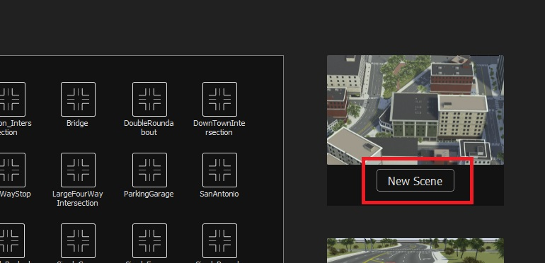
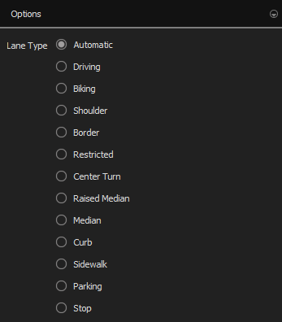

# Setup of Scenarios

In this chapter, we will talk about how to set up your own custom scenario of a real world location.

## Using Blender for Buildings

To start out creating our custom map, we will start by using blender to create the buildings. In this tutorial, we will also be using Blosm, so please have that installed before starting. It is also recommended to have premium version of Blosm to add more realism and building texture to the buildings. 

1. Open blender and open a blank new project

2. Once open, we will open up Blosm on the side of Blender


3. Now we will select our area of interest using the select button on Blosm, which will open a tab to a map. Here you can select an area you want to create a scenario for. It is recommended that the area be a bit bigger than your interested area, to add more realism and space to your custom map


4. Once you have your area, please copy the selected area using the website instruction on the right side and then paste those coordinates into Blosm with the paste button


5. Once pasted, you can now add elevation data to your blender file by using the terrain import function. In the section below the coordinates, you can select terrain and then click on the import button


6. Once a gray plane with the terrain data has been imported, you can now add buildings to your file

7. This can be done by going back to the OpenStreetMap Tab on Blosm

8. Before you select import, make sure to select Import for Export, Import Buildings, and Relative to Initial Import and then deselect Import as a Single Object and Import Forest


9. Now import the buildings by clicking import

10. This should have imported your buildings on to the terrain surface

11. Now that you have the buildings for your custom map, you can export these buildings by firstly selecting all the buildings under the Map_XX.osm_buildings


12. Then under file, click Export and use FBX to export your file 

13. When exporting, Please select the Limit to Selected Objects so that only the buildings are exported

14. Another note is to be careful on how many buildings you are exporting at one time, as CARLA can only handle so many buildings at one time during import. We recommend limiting it to only 1000 buildings per export

15. You now have your buildings for your scenario, which can be imported later

## RoadRunner

Now with the buildings done, we can move to the roads for the custom maps. This section will cover how to start using RoadRunner and what data will be needed. As stated many times before, RoadRunner is a software which can be used to develop a road for your custom map. The software is quite robust and can be easily used to create a very accurate representation of your area's street design, although this does take some time to implement accurately. RoadRunner has some functions where it can take map data and transform it into streets, but the results can vary quite greatly, and it is not recommended if streets have complicated street design and or street layouts, as the import will make quite a mess with these special situations.  


## OSM Data

The first piece of data that is necessary and helpful for creating a custom roadway will be OpenStreetMap (OSM) Data. This will be our baseline data, which we will build off of. This data can be downloaded from OSM very easily. You can use the coordinates from Blender to select the area you want to download so that it matches exactly. You may run into issues with exporting your area in that your areas contains too many objects in your selected area. One way to solve that would be to download OSM data through Geofabrik and select the area you have interest in recreating.

[OpenStreetMaps](https://www.openstreetmap.org/)

[Geofabrik Download Server](https://download.geofabrik.de/)

## Elevation Data 

To best represent your area of interest, it will be important to have elevation data for your specific area. This data can typically be found online through your regional GIS governing body, but availability may depend on whether that data is openly provided or not. Some areas, do not have this data available, so you will be left with open source data, which is typically less accurate and low-resolution data, which may affect the accuracy of the digital copy of your test area. The data to be used in building your road network will need to be in a DEM, IMG, or TIFF file, which may mean that you will have to convert your data so that RoadRunner can actually use the elevation data. If, for example, your data is in a vector shape file with contour lines, you will have to transform your vector data into a TIN Raster, which can be done using QGIS and the TIN interpolation processing tool. Below is the documentation from QGIS on how to use this function, as well as a YouTube video of how to interpolate the data.  One thing to note is that it is important to have your coordinate system in the same format as the OSM data, which is WGS 84. QGIS can transform vector data quite easily to the desired coordinate system. The final result should look like the example below. Once you have the elevation data in a format which can be used by RoadRunner, we will move on to creating a RoadRunner map.

[QGIS Interpolation](https://docs.qgis.org/3.28/en/docs/user_manual/processing_algs/qgis/interpolation.html#tin-interpolation)

[QGIS Interpolation Videio](https://www.youtube.com/watch?v=kAvGW0yH6_E&embeds_referring_euri=https%3A%2F%2Fcdn.iframe.ly%2F&source_ve_path=Mjg2NjY&feature=emb_logo)


This may not apply to everyone, especially as the type of elevation data varies depending on the data openly available, but we received a contour vector data set from the state of North Rhein-Westphalia, which conducted a Lidar scan of the area and which is the basis of this vector data. The data is in a contour vector, with each line signifying an elevation. To make this data useable, we imported it into a QGIS file, making sure to import it into a project in the correct WGS 84. Once inserted into our QGIS file, we then added a few attributes of Elevation to the data set. This can be done by using the calculator function in QGIS, which can add data to your data. Once that was done, we used the TIN interpolation tool, which takes a vector data set and vector attribute and translates that into a raster surface. Make sure that the raster size is appropriate to the size and resolution of the data. This may take some time. Once that is done, we used a raster resample interpolation tool, which interpolates the data between points to create a smoothed raster surface. This tool is part of the GRASS tools, which is a plugin for QGIS. Then we saved the new raster surface and exported it in the proper coordinate system. (Some issues may occur with exporting in the proper coordinate systems, which may require you to use the Assign projection tool)

## Road Building

Now with all the important pieces of data for RoadRunner, which includes the OSM data and topography data, we can start creating our custom map. 

1. Create a new project in Roadrunner 


2. Create a new scene



3. Now with a new scene open, we can start creating the map

4. First, we will place our OSM data and Topography data into the library browser, which can be done by dragging the two files into the library browser. It is recommended to create a new folder in the library browser to contain all your map information. This can be done by right-clicking on the explorer and going to New → Folder

5. Your files should look like this, one containing the topography data and one containing the OSM data


6. With your files now properly added, you will want to make sure that the topography data is set to the right default type. This can be done by right-clicking on the topography data and selecting topography 


7. Now with the data prepared for Roadrunner, we can add it to the scene. Simply drag the OSM data and topography data into the scene
   
8. Once they are dragged into the scene, you should see a topography map and OSM map. If not, you can press F5 and F7, which should bring up the data. It should look something like below


9. If you find the OSM map too cluttered and hard to understand, because of both the building information and land information being shown, you can remove the OSM data from your scene and add only the OSM data for roads. This can be done by adding the OSM data through SD Map Viewer Tool. This will only add the road network of the OSM data

10. Now, with all the necessary data to create your scenario in your scene, we can start creating the road network. This can easily be done by using the road plan tool found in the upper left side of the program

11. Clicking on this should bring you into the tool, and you can start adding roads to your scene. Simply right-click on the location you would like to start a  street and then once again to end the segment

12. Now with your first street in your desired location, we can add some detail to that street. First, we can add topography data by telling Roadrunner to add the topography data to the streets by clicking on project roads on the left side of the program


13. We have now added topography to our roads. If there are issues with some sharp corners on the street, this is probably due to issues in the elevation data and or with intersections. This can be solved by looking at the profile of the roads in the bottom left


14. The blue line indicates the elevation of the topography data (the resolution of the topography map on this was poor, which caused the stair stepping effect), the purple line is the selected road, and the green line is the elevation of the intersecting road. You can adjust the profile of the road by moving the purple dots to better fit the topography and intersections

15. You can also add more elevation points on the road segment by right-clicking on the purple profile line and moving them accordingly

16. You may have also noticed the road you have placed is incorrect or not matching the road you are trying to replicate. RoadRunner provides a few different types of roads, but is not limited to just these road types, as roads can be adjusted to your needs. To change the road, you can navigate to the RoadStyles folder in the library browser

17. In the RoadStyles folder, you will find a few different road types. You can grab one of these road types and apply it to your road. Simply drag the road type to the road segment, and it will change the road segment


18. This is a great way to change the road segment to fit your needs, but you may notice it is quite limited on what road types provide and that your road segment is a one-off case and does not fit one of these road styles. To fix this or change the road segment, we can add lanes, adjust lane width, sidewalk width, and adjust the direction of lanes

19. Adding lanes is quite easy, you just need to click on the lane add tool in the middle of the toolbar on the top and once active you can now add lanes to your road segment


20. With the lane add tool active, you can add lanes to your road segment by right-clicking on the road segment red lines, which indicate the lanes on the road segment
    
21. You can specify which type of lane type is added, the list of lane types can be found on the right side of the program. The default option for lane type is automatic, which will add lanes in comparison to the other lanes around it



22. Now, with the additional lanes added, you may want to adjust the width of those lanes to fit and better represent the area you are trying to recreate. To do this, you can adjust the lane width with the lane width tool, which can be found in the middle of the toolbar. To remove lanes, select them (best done in the lane tool) and hit delete 


23. Clicking on a lane brings up a window on the right side of the program where you will find  and adjust the current width
    


24. Now that you have adjusted the lane width maybe, you want to change the direction of the traffic on the road and want to make it a one way roadway or remove access to a road segment. You can do that by selecting the lane tool. The lane tool give you the ability to adjust the direction, restrict access to the lane (Note: undirect restricts all access to the lane), change the material type, set a speed limit on the road, and change the lane type of the road

25. You will find on the right side of the program all these option that you can adjust. Under travel direction, you can adjust the direction of traffic in that lane


26. As stated before, you may also change the lane type in the attributes. You must be careful when doing this to apply the correct travel direction, when changing lane type, as this does not change automatically when changes are done to the lane type. As an example, if you change a driving lane to a bicycle lane, RoadRunner will still give access to cars, even though this access should be restricted

27. Now you know how to really customize your streets, but some road intersections are quite special for example if three different types of roads are coming together. To address these special cases there is the custom junction tool which can be found in the top left on the toolbar


28. This tool will create custom intersections to help create a nicer intersection, compared to the other intersection method of having the road segments cross each other. The standard intersection method should be the go-to, and only when needed the custom intersection method  should be used

29. As you have now started creating your road network and are getting close to getting done, it is important to check if all the intersections make sense and that vehicles will preform the correct maneuver. One way to check this is by using the maneuver tool, found on the left side of the toolbar


30. The maneuver tool will let you look at the intersection and adjust and change all maneuvers that are allowed at the intersection. It typically is correctly done, but at very complicated intersection, it will require adjustment by deleting or adding maneuvers. Adding maneuvers is easily done by right-clicking one point and clicking another. Delete can be done by clicking a maneuver and pressing the delete button

31. The intersection can also be automatically rebuilt if you want to start over or something is incorrect by pressing the rebuild maneuver roads on the right side of the program


32. The next feature that you may have come across when creating your scene is the ability of creating terrain surfaces between road segments. These surfaces will appear  when road segments make a closed loop, or can be created manually by using the surface tool, found on the right side of the toolbar


33. Like many other tools in this program, you can simply right-click to add surfaces. The surface will be added once an area has been closed off

34. You can also apply elevation data from the topography data by using the apply GIS data on the left side of the program, while selecting the surface at the same time push the apply GIS data and the surfaces should conform as best as possible to the topography data


35. One last tool, we will talk about is the lane marking tool, which changes the lane stripping to your needs. The tool can be found in the middle of the toolbar


36. Lane marking tools can be changed by navigating to the markings' folder in the library browser. When you click on road markings on a road segment you will see the lane marking attributes on the right.  You can change the lane striping by either dragging the marking style from the library browser to the road segment or by dragging it to the marking style in the attributes

37. Other features of RoadRunner you can learn from RoadRunner documentation page

[RoadRunner Tutorial](https://de.mathworks.com/login?uri=https%3A%2F%2Fde.mathworks.com%2Fhelp%2Froadrunner%2Findex.html%3Fs_tid%3DCRUX_lftnav&context=behindmwa)

## Exporting 

You have created a new road network for your scenario and are happy with what you have built. Now it is time to export your network for CARLA. 

1. The first step to exporting the network is to check the network for errors and issues. This can be done by using the OpenDRIVE export preview tool, which will look at the road network and identify any issues that may arrive in the network

2. Press the OpenDRIVE export preview tool, which is found on the right side of the tool, and accept the standard setting and press export


3. If any errors appear or such as red text in the output log, it may require you to make correction to your network. Some errors or warning can be ignored like intersection are to close so they are combined. Other error or warning should be looked at


4. Once the OpenDRIVE export preview looks good and the preview of the network looks visually good, you can export the file for CARLA

5. You can easily export your file by clicking on File -> Export -> CARLA Filmbox (.fbx, .xodr, .rrdata.xml)

6. Once the file are exported into a folder it can be imported into CARLA

## Importing

1. To import this into CARLA you will place the exported files into the import folder in the CARLA folder

2. Once the files are there in the import folder, we can import the files

3. Open a X64 Command Prompt and direct the command prompt to the CARLA folder by typing in the following command 

```
C: 
CD carla
```

4. Once open to the folder in command prompt, you can enter the following command to start the import process

```
make Import
```

5. This should run a script, which should import the files if this comes with an error you can directly run the python script by typing in the following commands

```
cd util\buildtools
import.py
```

6. Once the script is done running, you can now try opening CARLA to see if the import was successful 

7. Open Carla by typing in the following command by first going to the root folder of CARLA

```
cd ..
cd ..
make launch
```

8. Once CARLA is open, navigate in the content browser to the top folder content and select map_package

9. If map_package is not there, this means the import was unsuccessful, and you will need to reimport the network once again by using the command lines above. Make sure to close CARLA before retrying to import the scene

10. If imported correctly, the map should be under map_package -> Maps

11. Open the scene folder of your imported map, which should contain an orange item in the folder which is the level of your map


12. Your scenario is successfully imported, and you can now test if all was correctly imported in the level. A good test to run on your new scenario is to run to generate traffic command by typing in the following command in a separate command prompt

```
C:
CD Carla\pythonapi\examples
generate_traffic.py
```

13. Now that the level is exported and imported into CARLA, it is time to import the buildings built in Blender

14. This can be done by using the import feature in CARLA itself. It is recommended to navigate to the folder Content -> Carla -> Static and create a new folder in this folder for your buildings

15. Open your new folder and then click on add/import and then Import Asset and navigate to your exports of the buildings


16. Depending on how you exported your building, you may have to change the import scale

17. This may take some time to import the buildings 

18. Once imported you can find you building files in the folder

19. It is recommended to import all the buildings first 

20. Once all imported you can then select all the buildings and drag them into the level

21. Once all imported you can then select all the buildings and drag them into the level

22. This will take some time to find the correct place to center the buildings on and to get all the building at the correct and corresponding heights

## Adding Detail to Scenario

Now we have a great basis for our custom scenario we can add some details to our scene like signals, signs, trees, etc. These features will give our scenario more realism and will provide some rules for the basic traffic to follow like speed limits, stop signs, yield signs, and signals, but also provides realism and traffic controls to the test. Luckily, these additions are quite easy to implement into the level, as CARLA provides many of these details prebuilt. 

### Traffic Signage and Signals

Traffic signs and signals can be quickly added using the prebuilt signage and stop light functions. These are built by placing the object in the desired location and then adjusting the signal box to where the cars are required to act to this signage and behave accordingly. The CARLA documentation has a good description on how to implement these into the scenario.

[Carla Traffic Signals and Signage](https://carla.readthedocs.io/en/latest/tuto_M_custom_add_tl/)

### Vegetation

To add that extra bit of detail and realism, especially in areas with a high number of trees or other vegetation, one can add such details to your scenario quite easily. In CARLA, you can change modes from select mode which is the normal mode of CARLA and place it into foliage mode, which lets you quickly add foliage to your scenes. This can be done in a few easy steps.

1. Enter the foliage mode by click on the top toolbar and changing from select to foliage mode


2. Once in foliage mode, a new side menu will appear about foliage, this is where you can insert foliage into the paint tool

3. The foliage mode works like a simple paint mode, where you can quickly add foliage to a certain area by painting the terrain with a brush with the specified vegetation 

4. If you go to the folder containing the foliage, which is located under Content -> Carla -> Static -> Vegetation, you can find varying types of foliage for your scenario

5. Once you have found some foliage that matches your scenario, you can drag that foliage into the paint menu, and it will be added to the foliage paint tool


6. Once the foliage is added to the foliage paint tool, it can simply be added to the terrain, but before you add this foliage to the terrain it is important to look at the settings for said foliage, which can be seen if you select the added foliage in the left menu

7. In this menu, you can edit many variables, such as density of the foliage, the distance between each piece of foliage, scaling (size) of foliage, and many more other parameters. This may require testing and playing around with such parameters to achieve the desired look from the paint tool


8. Once your foliage is set up to your parameters, you can start painting your terrain by simply left-clicking the terrain, which should insert some foliage onto the terrain model

9. You may notice that the foliage you added is too dense or too sparse. This is due to the density of the foliage parameters or the density parameters in the paint tool, which will have to be changed to match your desired look. Again this may take some trial and error to achieve the desired effect

10. You can quickly turn off and on foliage by clicking the checkbox on the foliage item, which will turn on and off the addition of this foliage with the paint tool


11. You may have noticed that while painting the terrain that the foliage has attached itself to road and sidewalk segments, where you wish to not have any foliage present. To make sure foliage is not added to this layer of the terrain, you can change the terrain to movable, which will make the layer invalid for painting until it is changed to static once again

12. First, select the terrain object you wish not to receive foliage, on the left side menu the details for the terrain will be visible. In this menu, change the mobility from static to movable, this will disable the ability to pain on this surface


13. If you are also having issues with this to buildings, you can do the same thing as in the previous steps to the buildings, so that the paint tool does not add foliage to buildings
